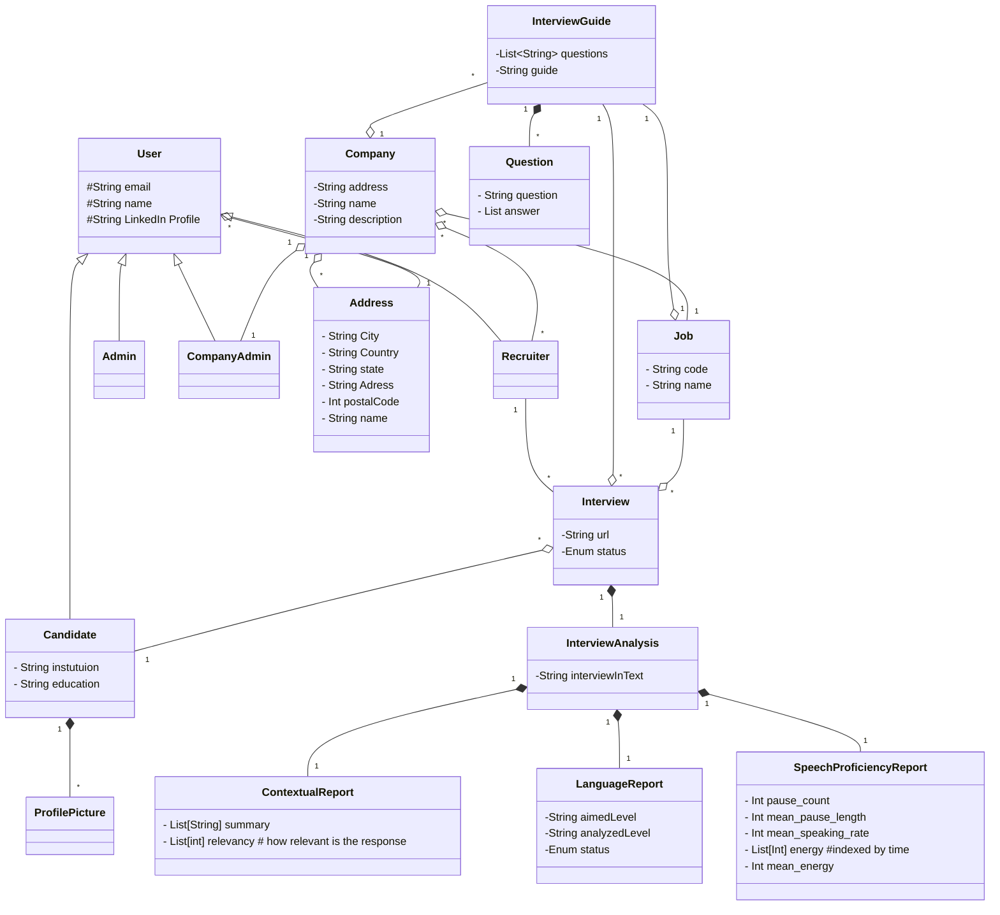

```mermaid
classDiagram
    User <|-- Candidate
    User <|-- Recruiter
    User <|-- Admin
    User <|-- CompanyAdmin

    Company "*" o-- "*" Recruiter
    Company "1" o-- "1" CompanyAdmin

    Recruiter "1" -- "*"Interview

    Interview "1" *-- "1" InterviewAnalysis

    Company "1" o-- "*" Address
    
    User "*" o-- "1" Address

    Candidate "1" *-- "*" ProfilePicture

    InterviewGuide "1" --o "*" Interview
    InterviewGuide "*" --o "1" Company
    InterviewGuide "1" --o "1" Job

    InterviewAnalysis "1" *-- "1" SpeechProficiencyReport
    InterviewAnalysis "1" *-- "1" LanguageReport
    InterviewAnalysis "1" *-- "1" ContextualReport

    Interview "*" o-- "1" Candidate

    Job "1"--o "*" Interview
    Company "*" o-- "1" Job

    InterviewGuide "1" *-- "*"Question

    class SpeechProficiencyReport{
        - Int pause_count
        - Int mean_pause_length
        - Int mean_speaking_rate
        - List[Int] energy #indexed by time
        - Int mean_energy
    }

    class ContextualReport{
        - List[String] summary
        - List[int] relevancy # how relevant is the response
    }

    class Address{
        - String City
        - String Country
        - String state
        - String Adress
        - Int postalCode
        - String name
    }

    class Question{
        - String question 
        - List <String, Int> answer
    }
    class Job{
        - String code
        - String name
    }
    class User{
        #String email 
        #String name
        #String LinkedIn Profile
    }
    class Candidate{
        - String instutuion
        - String education
    }
    class Recruiter{

    }
    class ProfilePicture{
    }

    class Admin{

    }

    class Company{
        -String address
        -String name
        -String description
    }

    class Interview{
        -String url
        -Enum status
    }
    class InterviewGuide{
        -List~String~ questions
        -String guide
    }
    class InterviewAnalysis{
        -String interviewInText
    }
    class LanguageReport{
        -String aimedLevel
        -String analyzedLevel
        -Enum status
    }
```
