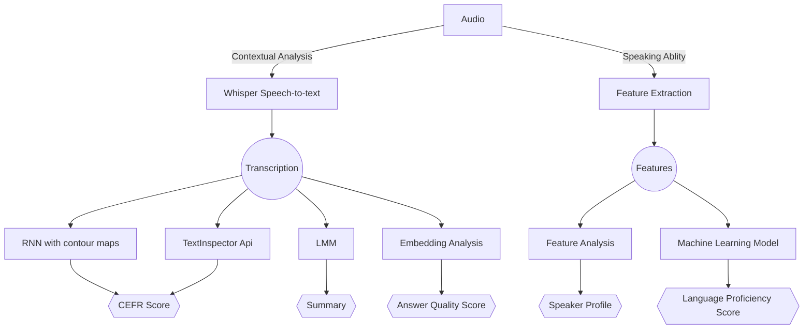

```mermaid
graph TD
    A[Audio] -- Contextual Analysis --> B[Whisper Speech-to-text]

    A[Audio] --Speaking Ablity--> C[Feature Extraction]

    C --> F((Features))

    F --> FA[Feature Analysis]
    FA --> P{{Speaker Profile}}

    F --> ML[Machine Learning Model]

    ML --> LP{{Language Proficiency Score}}

    B --> TR((Transcription))

    TR --> CRNN[RNN with contour maps]
    TR --> TI[TextInspector Api]

    CRNN --> CEFR{{CEFR Score}}
    TI --> CEFR{{CEFR Score}}

    TR --> LMM[LMM]
    LMM --> SM{{Summary}}

    TR --> EA[Embedding Analysis]
    EA --> AG{{Answer Quality Score}}


```
