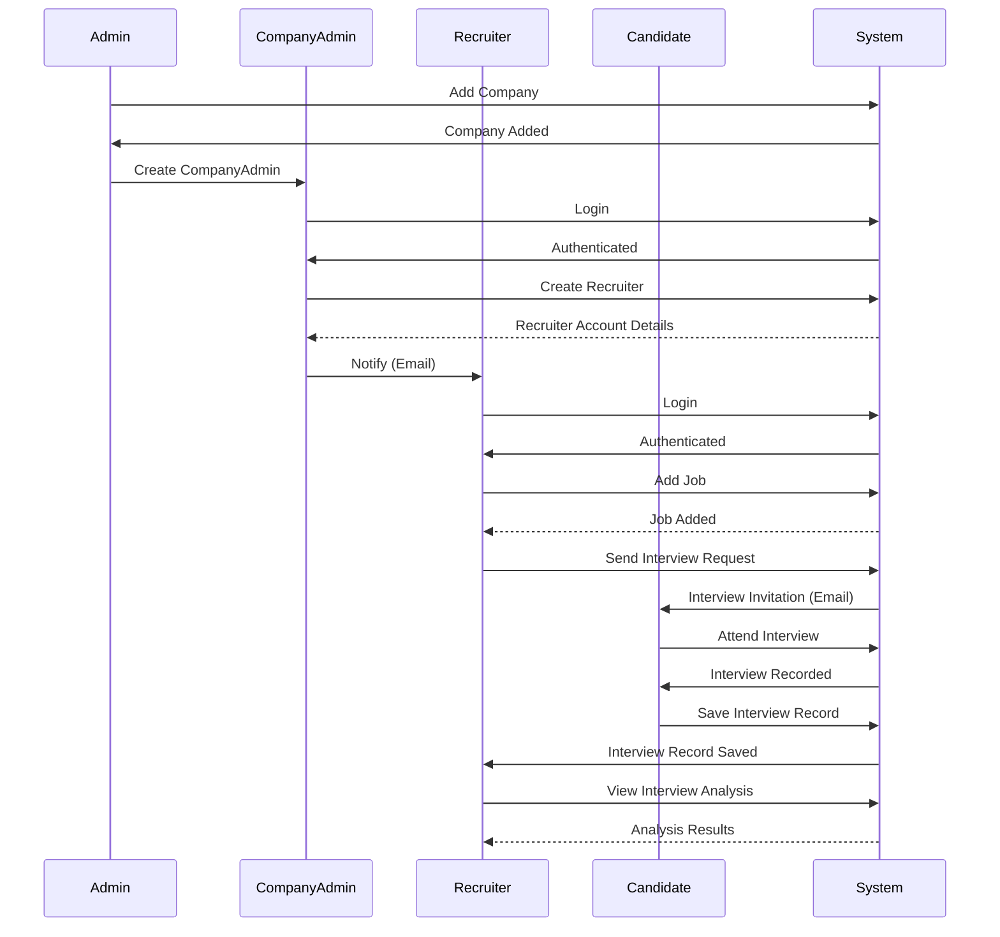

```mermaid
sequenceDiagram

    participant A as Admin
    participant CA as CompanyAdmin
    participant R as Recruiter
    participant C as Candidate
    participant S as System

  
    A->>S: Add Company
    S->>A: Company Added
    A->>CA: Create CompanyAdmin
    CA->>S: Login
    S->>CA: Authenticated
    CA->>S: Create Recruiter
    S-->>CA: Recruiter Account Details
    CA->>R: Notify (Email)
    R->>S: Login
    S->>R: Authenticated
    R->>S: Add Job
    S-->>R: Job Added
    R->>S: Send Interview Request
    S->>C: Interview Invitation (Email)
    C->>S: Attend Interview
    S->>C: Interview Recorded
    C->>S: Save Interview Record
    S->>R: Interview Record Saved
    R->>S: View Interview Analysis
    S-->>R: Analysis Results

```